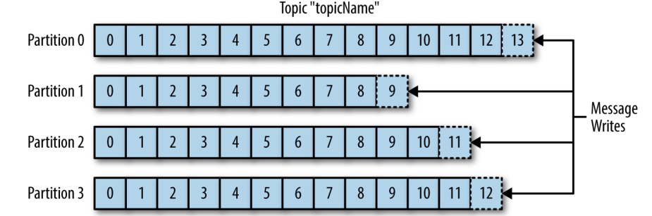
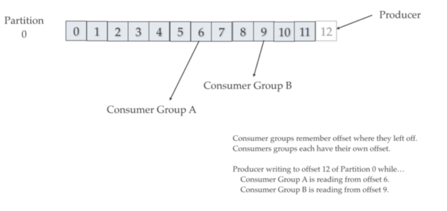
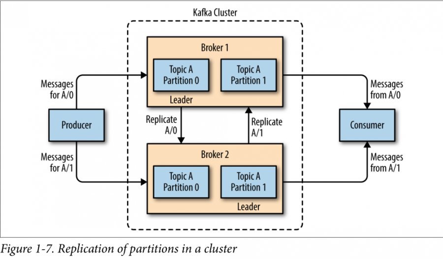
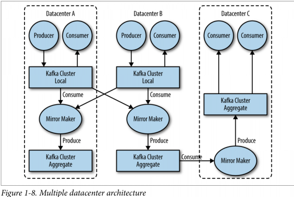
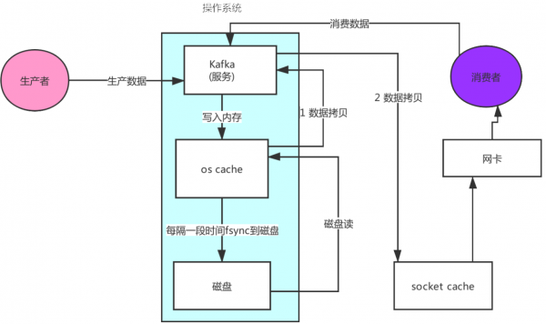
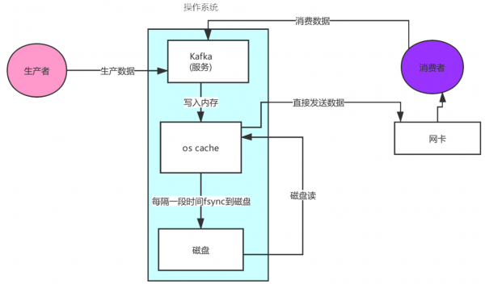
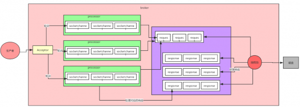

# Lesson01: Introduction Kafka basics

In this lesson, we will learn the basic concept of Kafka

## Prerequisite

There are many message queue systems on the market such as: ActiveMQ, RabbitMQ, RocketMQ, etc.

There are two patterns:

1. point-to-point : In this model, message(s) is sent from one application(producer or sender) to another
   application(consumer/receiver) via a queue. There can be more than one consumer listening on a queue but
   only one of them will be get the message. Because after message is read by one consumer, message will be deleted.
2. publish-subscribe : In this model messages are sent/persisted in a topic, consumers can subscribe to one or more
   topic and consume all the messages in that topic. Because message will not be deleted unless the retention period is reached
   (by default in kafka is 7 days)

In the Publish-Subscribe system, message producers are called publishers and message consumers are called subscribers.
A real-life example is Dish TV, which publishes different channels like sports, movies, music, etc., and anyone can
subscribe to their own set of channels and get them whenever their subscribed channels are available.

## 1.1 What is Kafka?

**Apache Kafka is a distributed publish-subscribe messaging system and a robust queue** that can handle a high volume
of data and enables you to pass messages from one end-point to another. Kafka is suitable for both offline and
online message consumption. **Kafka messages are persisted on the disk and replicated within the cluster to prevent
data loss**. Before Kafka 2.8.0, kafka must run on top of the ZooKeeper synchronization service. **Since 2.8.0, kafka
provides mode [KRaft](https://developer.confluent.io/learn/kraft/) that allows kafka to run without zookeeper**. It
integrates very well with Apache Storm, flink and Spark for real-time streaming data analysis

## 1.2 Kafka use cases

There are three main scenarios in which Kafka is the solution:

1. Incoming event velocity is higher than the throughput of storage, so you need **kafka as a cache to reduce the stress
   of storage system**.
2. You have many heterogeneous data source(e.g. sql, files, mongodb, etc) and many heterogeneous consumers.
   To avoid writing connectors for each pair of consumer and data source, you only need to write one kafka connector.
3. When you need **Asynchronous communication**.

Some real world example:

- **stream processing**: Popular frameworks such as Storm, flink and Spark Streaming read data from a topic,
  processes it, and write processed data to a new topic where it becomes available for users
  and applications. Kafka’s strong durability is also very useful in the context of stream processing.
- **metrics collection and monitoring**: Kafka is often used for collecting operational monitoring data. This involves
  aggregating statistics from distributed applications to produce centralized feeds of operational data.
- **log aggregation**: Kafka can be used across an organization to collect logs from multiple services and make them
  available in a standard format to multiple consumers.
- website activity tracking
- real-time analytics
- CEP
- ingesting data into Spark/Hadoop
- CQRS
- replay messages
- error recovery
- guaranteed distributed commit log for in-memory computing (microservices)

## 1.3 Kafka key concepts

- Message -> An array of bytes that kafka transfer from producer to consumer.
- Topic -> Each message in kafka must has a category, we call the category a Topic
- Partition -> Each Topic can have one or more Partitions. More partitions can increase the throughput of a Topic.
- Producer -> A program or process which can send messages to Broker
- Consumer -> A program or process which read messages from Broker
- Consumer group -> Each consumer belongs to a consumer group. When you create a consumer, you can specify consumer
  group name, otherwise kafka will assign a default group name.
- Broker -> In a kafka cluster, we may have one or many server. The server is called broker
- Schema -> A file that describes the structure of data.

### 1.3.1 Message and Batch

**The smallest unit of data within Kafka is called a message**. A message is simply an array of bytes as far as
Kafka is concerned, so the data contained within it does not have a specific format or meaning to Kafka.

**A message can have an optional bit of metadata, which is referred to as a key.** The key is also a byte array and,
as with the message, has no specific meaning to Kafka. Keys are used when messages are to be written to partitions in
a more controlled manner.

**For efficiency, messages are written into Kafka in batches. A batch is just a collection of messages**, all of which
are being produced to the same topic and partition. An individual roundtrip across the network for each message
would result in excessive overhead, and collecting messages together into a batch reduces this. Of course, this
is **a tradeoff between latency and throughput**: the larger the batches, the more messages that can be handled per
unit of time, but the longer it takes an individual message to propagate (High Latency).

**linger.ms** refers to the time to wait before sending messages out to Kafka. It defaults to 0, which the system
interprets as ‘send messages as soon as they are ready to be sent’.

**batch.size** refers to the maximum amount of data to be collected before sending the batch.

**Kafka producers will send out the next batch of messages whenever linger.ms or batch.size is met first.**

Batches are also typically compressed, providing more efficient data transfer and storage at the cost of some processing power.

### 1.3.2 Topics and partition

**Messages in Kafka are categorized into topics**. **Topics are additionally broken down into a number of partitions**.
Note that as a topic typically has multiple partitions, there is no guarantee of message time-ordering across the entire topic.

The following figure shows a topic with four partitions, with writes being appended to the end of each one.


The number here is the partition offset. All records(messages) in partitions are assigned sequential id
number(starts from 0) called the offset. The offset identifies each record location within the partition.
As a result, we can guarantee the message time-ordering inside of one partition.

**Partitions are also the way that Kafka provides redundancy and scalability.** Each partition can be hosted on a
different server, which means that a single topic can be scaled horizontally across multiple servers to provide
performance far beyond the ability of a single server.

To avoid data loss, partition has replications. We will give more details in the partition replication section.

#### Topic retention

Retention is the durable storage of messages for some period of time. Kafka brokers are configured with a default
retention setting for topics:

- for some period of time (e.g., 7 days)
- for a certain size in bytes (e.g., 1 GB)

Once these limits are reached, messages are expired and deleted so that the retention configuration is a minimum
amount of data available at any time. Individual topics can also be configured with their own retention settings.

Below are some possible examples:

- a tracking topic might be retained for several days
- application metrics might be retained for only a few hours.
- Topics can also be configured as **log compacted**, which means that Kafka will retain only the last message
  produced with a specific key. This can be useful for changelog-type data, where only the last update is interesting.

### 1.3.3 Producers and Consumers

#### Producer

**Producers create new messages. In general, a message will be written to a specific topic. By default, the
producer does not care what partition** a specific message is written to and will balance messages over all
partitions of a topic evenly.

**In some cases, the producer will direct messages to specific partitions by using the message key.** A partitioner
will generate a hash of the key and map it to a specific partition. This assures that all messages produced with a
given key will get written to the same partition.

#### Consumer

**Consumers read messages.** The consumer subscribes to one or more topics and reads the messages in the order in
which they were produced. The consumer keeps track of which messages it has already consumed by keeping track of the
offset of messages. **Each message in a given partition has a unique offset**. By storing the offset of the last
consumed message for each partition, either in Zookeeper or in Kafka itself, a consumer can stop and restart
without losing its place.

#### Consumer group

消费者组就是让多个消费者并行消费信息而存在的，而且它们不会消费到同一个消息.
(not sure)A single consumer in a group does not track the offset of messages. The group do the track.

```text
consumer group:a
  consumerA
  consumerB
  consumerC

```

#### Topic log

**A topic is associated with a log** which is a data structure on disk.

- **Records from a producer(s)** are appended to the end of a topic log. **A topic log consists of many partitions**
  that are spread over multiple files which can be spread on multiple brokers.
- Consumers read from Kafka topics at their cadence and can pick where they are (offset) in the topic log.
  **Each consumer group** tracks offset from where they left off reading.

Kafka distributes topic log partitions on different nodes in a cluster for high performance with horizontal scalability.
Spreading partitions aids in writing data quickly. Topic log partitions are Kafka way to shard reads and writes to the
topic log. Also, partitions are needed to have multiple consumers in a consumer group work at the same time. Kafka replicates
partitions to many nodes to provide failover.



### 1.3.4 Stream

The term stream is often used when discussing data within systems like Kafka. **Most often, a stream is considered to
be a single topic of data, regardless of the number of partitions. This represents a single stream of data moving
from the producers to the consumers.** This way of referring to messages is most common when discussing
stream processing, which is when frameworks (e.g. Kafka Streams, Apache Samza, and Storm) operate on the messages
in real-time. There is also batch processing which is when offline frameworks (e.g. Hadoop, hive) work on bulk data
at a later time.

### 1.3.5 Schema

**It is recommended that additional structure, or schema, be imposed on the message content**(e.g. json, XML and avro).
Many Kafka developers use Apache Avro, which is a serialization framework originally developed for Hadoop.
Avro provides a compact serialization format; schemas that are separate from the message payloads and that do not
require code to be generated when they change; and strong data typing and schema evolution, with both backward and
forward compatibility.

A consistent data format is important in Kafka, as it allows writing and reading messages to be decoupled. By using
well-defined schemas and storing them in a common repository, the messages in Kafka can be understood without coordination.

### 1.3.6 Broker and cluster

**A single Kafka server is called a broker**. The broker receives messages from producers, assigns offsets to them,
and commits the messages to storage on disk. It also services consumers, responding to fetch requests for partitions
and responding with the messages that have been committed to disk. Depending on the specific hardware and its
performance characteristics, a single broker can easily handle thousands of partitions and millions of messages per second.

#### Controller

**Kafka brokers are designed to operate as part of a cluster.** Within a cluster of brokers, **one broker will also
function as the cluster controller (first arrived broker is elected automatically).** The controller is responsible
for administrative operations, including assigning partitions to brokers and monitoring for broker failures.

#### Leader

A partition is owned by a single broker in the cluster, and that broker is called the leader broker of the partition.
All consumers and producers operating on that partition must use the leader broker. A replication of the partition
may be assigned to multiple brokers(as seen in Figure 1-7). This provides redundancy of messages in the partition,
Note **replication partition only has effect when the leader partition (broker) is down**.



### 1.3.7 Multiple Clusters

As Kafka deployments grow, it is often advantageous to have multiple clusters. There are several reasons why this can be useful:

- Segregation of types of data
- Isolation for security requirements
- Multiple datacenters (disaster recovery)


When working with multiple datacenters in particular, it is often required that messages be copied between them.
In this way, online applications can have access to user activity at both sites. **The replication mechanisms within
the Kafka clusters are designed only to work within a single cluster, not between multiple clusters**.

#### MirrorMaker

The Kafka project includes a tool called MirrorMaker, used for this purpose. At its core, MirrorMaker is simply a
Kafka consumer and producer, linked together with a queue. Messages are consumed from one Kafka cluster and produced
for another.

Below figure shows an example of an architecture that uses MirrorMaker, aggregating messages from two local clusters
into an aggregate cluster, and then copying that cluster to other datacenters.




### 1.3.8 In-Sync Replica (ISR)

Kafka considers that **a record/message is committed when all replicas in the In-Sync Replica set (ISR) have confirmed
that they have written the record to disk.** The acksall setting requests that an ack is sent once all in-sync replicas
(ISR) have the record.

#### Apache Kafka ack-value (Producer config)

An acknowledgment (ACK) is a signal passed between communicating processes to signify acknowledgment, i.e., receipt of the message sent. **The ack-value is a producer configuration parameter** (So, you will not find it in the server.properties file) in Apache Kafka and can be set to the following values:

1. **acks0**: The producer never waits for an ack from the broker.** No guarantee can be made that the broker has
received the message**. No retry to send the record again since the producer never knows that the record was lost.
**This setting provides lower latency and higher throughput at the cost of much higher risk of message loss**.
2. **acks1**: The producer gets an ack after the leader has received the record. **The leader will write the record to
its log but will respond without awaiting a full acknowledgment from all followers**. The message will be lost only
if the leader fails immediately after acknowledging the record, but before the followers have replicated it.
**This setting is the middle ground for latency, throughput, and durability. It is slower but more durable than acks0.**
3. **acksall(or -1)**: The producer gets an ack when all in-sync replicas have received the record. The leader will
wait for the full set of in-sync replicas to acknowledge the record. **This means that it takes a longer time to
send a message with ack value all, but it gives the strongest message durability**.

#### What is the ISR (In-Sync Replica)?

The ISR is simply all the replicas of a partition that are "in-sync" with the leader. The definition of "in-sync"
depends on the topic configuration, but by default, it means that a replica is or has been fully caught up with the
leader in the last 10 seconds. The setting for this time period is: **replica.lag.time.max.ms** and has a server
default which can be overridden on a per topic basis.

PS: In Kafka 2.5, the default value of zookeeper.session.timeout.ms has been increased from 6s to 18s and
**replica.lag.time.max.ms from 10s to 30s**.

The ISR consists of **the leader replica and any additional follower replicas that are also considered in-sync**.
Followers sends Fetch Requests periodically(by default every 500ms) to leader to sync replicate data.
**If a follower fails or lagging behind, after 10 seconds it will be removed from the ISR.**

#### What is ISR for?

The ISR acts as a tradeoff between data safety and latency.

#### ISR Achilles heel

If all followers are going slow, then the ISR might only consist of the leader. So an acksall message might get
acknowledged when only a single replica (the leader) has it. To avoid this, the **min-insync.replicas** in broker/topic
configuration needs to be set** to (at least)2** for example. If the ISR does shrink to one replica, then the
incoming messages are rejected. It acts as a safety measure for when we care deeply about avoiding message loss.

Note: **The minimum number of in-sync replicas has nothing to do with the throughput**. Setting the minimum number
of in-sync replicas to larger than 1 may ensure less or no data loss, but throughput varies depending on the ack
value configuration. The default minimum in-sync replicas number is 1.

## 1.4 Why Kafka?

Kafka has many advantage compares to other Message queue system. For example

- High throughput
- High performance
- Disk-based retention
- Horizontal scalability

### 1.4.1 High throughput

Kafka achieve high throughput by profiting distributed system. Data are divided into partitions and distributed into
different brokers(server). This allows kafka to handle multiple producers and consumers.

#### Multiple Producers

Kafka is able to seamlessly handle multiple producers, whether those clients are using many topics or the same topic.
This makes the system ideal for aggregating data from many frontend systems and making it consistent.

For example, a site that serves content to users via a number of microservices can have a single topic for page
views that all services can write to using a common format. Consumer applications can then receive a single stream
of page views for all applications on the site without having to coordinate consuming from multiple topics, one for
each application.

#### Multiple Consumers

In addition to multiple producers, Kafka is designed for multiple consumers to read any single stream of messages
without interfering with each other. **This is in contrast to many queuing systems where once a message is consumed
by one client, it is not available to any other.** Multiple Kafka consumers can choose to operate as part of a
group and share a stream, assuring that the entire group processes a given message only once.


### 1.4.2 High performance

Kafka achieves high performance by increasing disc IO speed and applying Zero copy principal.

#### Sequential IO

**Kafka writes to filesystem sequentially** which is fast. On a modern fast drive, Kafka can easily write up to
700 MB or more bytes of data a second. (操作系统每次从磁盘读写数据的时候，需要先寻址，也就是先要找到数据在磁盘上的物理位置，
然后再进行数据读写，如果是机械硬盘，寻址就需要较长的时间。kafka用的是**顺序写**，追加数据是追加到末尾，磁盘顺序写的性能极高，在磁盘个数一定，
转数达到一定的情况下，基本和内存速度一致. **随机写**的话寻址就需要较长的时间，性能会较低)

**Kafka scales writes and reads by sharding topic logs into partitions**. Recall topics logs can be split into
multiple partitions which can be stored on multiple different servers, and those servers can use multiple disks.
Multiple producers can write to different partitions of the same topic. Multiple consumers from multiple consumer
groups can read from different partitions efficiently.

#### Zero copy principal

先来看看非零拷贝的情况，数据的拷贝从内存拷贝到kafka服务进程那块，又拷贝到socket缓存那块，整个过程耗费的时间比较高。


kafka利用了Linux的sendFile技术（NIO），省去了进程切换和一次数据拷贝，让性能变得更好


For more detail on zero-copy principal, plz visit [[employes:pengfei.liu:data_science:kafka:zero_copy|Zero - Copy Principal]]


### 1.4.3 Disk-Based Retention

Durable message retention means that **consumers do not always need to work in real-time**. Messages are committed
to disk and will be stored with configurable retention rules. If a consumer falls behind or stopped, there is no
danger of losing data or blocking the producer. Because the messages will be retained in Kafka. This allows
consumers to restart and pick up processing messages where they left off with no data loss.

To avoid large files in the file system which will reduce the read/write performance. Kafka set the maximum size
for each topic log file. For example, A topic which has more than 100 million records is stored in three log file.
The name of the log file is the starter offset of the record in each file.
```text
00000000000000000000.index
00000000000000000000.log
00000000000000000000.timeindex

00000000000005367851.index
00000000000005367851.log
00000000000005367851.timeindex

00000000000009936472.index
00000000000009936472.log
00000000000009936472.timeindex
```

Kafka broker有一个参数，log.segment.bytes，限定了每个日志段文件的大小. You can set any size which is less than 1GB.
一个日志段文件满了，就自动开一个新的日志段文件来写入，避免单个文件过大，影响文件的读写性能，这个过程叫做**log rolling**，
正在被写入的那个日志段文件，叫做**active log segment**。


### 1.4.4 Horizontal scalability

Kafka’s flexible scalability makes it easy to handle any amount of data. Users can start with a single broker as
a proof of concept, expand to a small development cluster of three brokers, and move into production with a larger
cluster of tens or even hundreds of brokers that grows over time as the data scales up.

**Expansions can be performed while the cluster is online**, with no impact on the availability of the system as
a whole. This also means that a cluster of multiple brokers can handle the failure of an individual broker, and
continue servicing clients. **Clusters that need to tolerate more simultaneous failures can be configured with higher
replication factors**.


## 1.5 Kafka network architecture

kafka的网络设计和Kafka的调优有关，这也是为什么它能支持高并发的原因


- 首先客户端发送请求全部会由Acceptor来处理，一个broker里面会存在n个processor线程（默认是3个。Acceptor不会对客户端的请求做任何的处理，直接封装成一个个socketChannel发送给这些processor形成一个队列，发送的方式是轮询（roundrobin），就是先给第一个processor发送，然后再给第二个，第三个，然后又回到第一个。
- 消费者线程去消费这些socketChannel时，会获取一个个request请求，这些request请求中就会伴随着数据。线程池里面默认有8个线程，这些线程是用来处理request的，解析请求，如果request是写请求，就写到磁盘里。读的话返回结果。
- processor会从response中读取响应数据，然后再返回给客户端。
  这就是Kafka的网络三层架构。所以如果我们需要对kafka进行增强调优，增加processor并增加线程池里面的处理线程，就可以达到效果。request和response那一块部分其实就是起到了一个缓存的效果，是考虑到processor们生成请求太快，线程数不够不能及时处理的问题。

所以这就是一个加强版的reactor网络线程模型。
