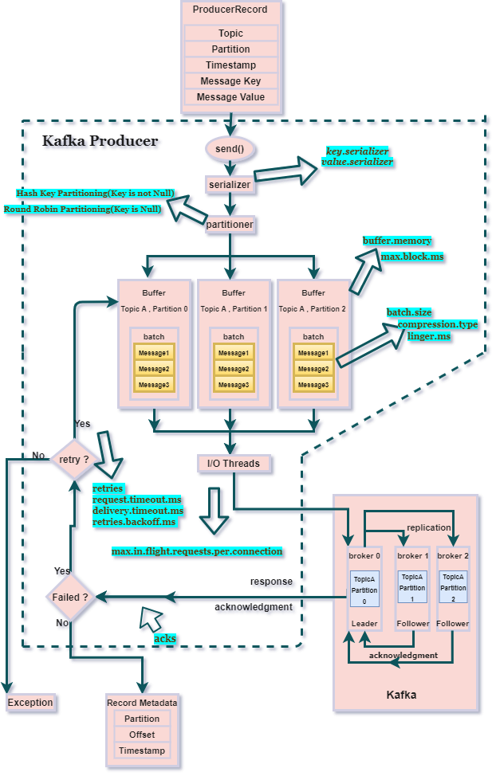
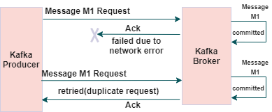

# 4. Kafka producer

In this document, we explain:
1. Kafka producer architecture components
2. Kafka producer workflow of sending a message
3. Kafka producer producer configuration options
4. Configuration example for different mode
5. Idempotent Producer
6. Safe Producer

## 4.1 Architecture

Kafka producer and the various components is responsible for sending/delivering the messages to the Kafka broker
(topic -partition).

Below figure shows the internal architecture of Kafka producer


### 4.1.1 Important components of the Kafka producer

- **Send()**: It adds the record to a buffer of pending records to be sent and returns immediately. This buffer of
  pending records helps to batch together individual records for efficiency.
- **Interceptor(optional)**:  Kafka Clients support pluggable interceptors to examine (and potentially modify) messages.
  For example, Confluent Control Center uses an interceptor that collects statistics on incoming and
  outgoing messages to provide Stream Monitoring.
- **Serializer**: It helps serialize the key and the value objects that the user provides with their ProducerRecord
  into bytes.
- **Partitioner**: Partition assignment to every ProducerRecord is done by the Partitioner. There are two types of
  partitioning strategies:
  - **Round Robin Partitioning**: This is used when the key is Null in ProducerRecord. Partitions are assigned in Round
    Robin fashion.
  - **Hash Key-based Partitioning**: This is used when ProducerRecord has a key. Partitions are determined based on
    the hash of the key for a particular message/value.
  - **Topic Partition** can also be mentioned directly in the ProducerRecord. In that case, Round Robin and Hash Key
    Partitioning will not make any effect.
- **Buffer**: A memory buffer of the unsent records is maintained by the producer for each partition. The size of
  the buffer can be set by the batch.size config.
- **I/O Threads**: The background I/O thread is responsible for turning the records in the buffer into requests and
  transmitting them to the Kafka broker.

## 4.2 Workflow of producer for sending a message

### Step1: Prepare ProducerRecord

Creating a **ProducerRecord** which has

- the topic-name
- partition
- Timestamp
- the message-value
- the message-key

Then call method **send()** to send the ProducerRecord

### Step2: Interceptor (Optional)

If you want to monitor or modify the **ProducerRecord**, you can add a Interceptor before serializer.ProducerRecord

### Step3: Serializer

Now, the ProducerRecord arrives at the serializer where the key and value are serialized into ByteArrays. The serialization
facilitate the data exchange over the network.

### Step4: Partitioner

Now, the ProducerRecord arrives at the partitioner. If the partition is specified in the ProducerRecord, then the
partitioner will return the same. If no partition in the ProducerRecord, the producer will check if there is a custom
partitioner, if yes, then use it. Otherwise, a default partitioner will choose a partition for the message.
If the message contains a key, then it will use the Hash of message Key to determine the partition. Otherwise, 
the default partitioner will use sticky partitioning (choose a random partition at the start and use this partition until it's full). 

The advantage of partition is:
1. load balance disk usage of each broker. For example, if we have 100To and 10 broker, each broker only need to store 10To
2. Increase throughput of the kafka cluster. If one broker can write 100Mo/s, then 10 broker can write 1000Mo/s. So
   consumer can read message with 1000Mo/s.

### Step5: Batch Buffer memory

For each partition of each topic, there is a corresponding batch buffer memory. Once the partition of ProducerRecord
is determined, the producer adds the **message-value (without other fields)** to the corresponding batch buffer
(the same topic and partition).

Once the message arrives at the buffer memory, the send() returns and starts processing the next ProducerRecord.

### Step6: I/O thread

A separate **I/O thread** is responsible for sending those batches of records as a request to the Kafka broker. When the
broker successfully receives the messages, I/O thread will return a RecordMetadata object as response and it has the
topic, partition, and offset of the record within the partition.

If the message fails to be received by the broker, I/O thread will return an error as a response, and the producer may
retry sending the message a few more times (No. of retries) before giving up and returning the error.

## 4.3 Important producer configurations

### 4.3.1 Acknowledgements of message

**Acks** configures the number of acknowledgments the producer requires the leader to have received before considering
a request complete. The following settings are allowed:

1. **acks = 0**: No acknowledgment. Messages will be added to the buffer and considered sent. No assurance can be
   given that the message was received by the broker.
2. **acks = 1**: The producer will wait for the acknowledgment only from the leader broker. No guarantee can be made
   that the message was received by the follower broker or that the message was replicated properly.
3. **acks = -1 (all)**: The producer will wait for the acknowledgment from the full set in-sync replicas
   (leaders + followers ). This guarantees that the record was received by all the in-sync brokers
   and as long as at least one in-sync replica broker remains alive, the message will not be lost.

#### Example:

Suppose we have the following kafka broker setup, and we set **acks = all** in the producer

```text
No. of brokers = 3
Replication Factor = 3
min.insync.replicas = 2 (including leader),
```

As the min.insync.replica is two , we can only tolerate one broker going down. If more than one broker goes down,
the message may get lost and won't get served to the consumer.

#### Trade-Off

Also, setting acks to "1" or "all" may increase the latency since the producer needs to wait for the ack. So we are
facing a trade-off between performance and quality of message delivering. Based on your requirements, you need to choose
one over the other, you can't have them both.

### 4.3.2 Retries and Timeouts -

- **retries =(some integer value)**: It represents the number of times the producer retries sending the message whose
  send() got failed. However, an issue while retrying is that the order of messages/requests may change.
- **max.in.flight.requests.per.connection**: It defines the max number of requests that can be sent on a connection
  before blocking. Setting this value to 1 means that only one request will be sent at a time thus
  preserving the message order and hence the ordering issue caused by the retry is solved.
  Based on Kafka versions, the recommended value change:
  - max.in.flight.requests.per.connection = 1 (0.11 >= Kafka < 1.1)
  - 5 (Kafka >= 1.1)
- **request.timeout.ms**: The amount of time the producer waits for the response of a request. The producer will
  consider the request as failed if the response is not received before the timeout elapses and begins to
  retry the request.
- **delivery.timeout.ms**: The upper bound on the time to consider the message delivery request a success or failure
  after a call to send() returns. (delivery timeout = time delay prior to sending + time to await ack + time for retries.)
- **retries.backoff.ms**: The amount of time to wait before attempting to retry a failed request to a given topic partition.

### 4.3.3 Batching

- **batch.size**: This configuration controls the default batch size in bytes. The producer will attempt to batch
  multiple records together into fewer requests that are being sent to the same partition.
- **linger.ms**: Instead of sending a record as soon as possible, the producer will wait for linger.ms time before
  sending the record. This allows multiple records to be batched together.

Batch request will be sent to the broker based on the following scenarios:

1. if batch.size worth of records arrive then a batch request will be sent.
2. if batch.size worth of records are yet to accumulate , then it will linger for a specified amount of time for more
   records to shows up.

Also, batching and lingering can **increase the latency of the record sent but can reduce the number of requests to the broker**

### 4.3.4 Buffer Memory

- **buffer.memory**: The total bytes of memory the producer can use to buffer records waiting to be sent to the server.
  This buffer is maintained for each topic partition.
- **max.block.ms**: The configuration controls how long the Kafka producer’s send() methods will be allowed to remain
  blocked waiting for metadata fetch and buffer allocation. **max.block.ms** is the upper bound of
  allowed (waiting time for metadata fetch + waiting time for buffer allocation). It throws an
  exception if the producer is in waiting state for more than  max.block.ms.

### 4.3.5 Compression

- **compression.type**: It defines the compression type for a batch(which contains multiple records)
  The default value is **none** (i.e. no compression).

Other valid values:

- none
- gzip
- snappy
- lz4
- zstd

As compression is for the full batch of data (multiple records being sent to the same partition), the efficiency of
batching will also impact the compression ratio (more batching = better compression).

Reason for choosing the compression can be as follows —

1. It will reduce the disk footprint and use a lesser amount of disk space for buffer memory.
2. It will also reduce the request size send to Kafka brokers which will lead to reduction in latency.

Note Compression is not free, it may consume some amount of CPU.

## 4.4 Configuration example for different mode

Note to achieve different mode, we need to configure not only the producer, but also the broker.

### 4.4.1 At-least-once-delivery

For achieving 'at-least-once-delivery', it is recommended to set:

```text
acks = all
retries = Integer.MAX_VALUE (provided the replication factor and min.insync.replicas are properly set).

```

### 4.4.2 At-most-once-delivering

### 4.4.3 Exactly-once-delivering

## 4.5 Idempotent Producer

### 4.5.1 what an Idempotent producer is and what problems it solves?

Let’s suppose your Kafka producer does not receive an acknowledgment (may be due to network failure) and retries the
request even though the message was committed to the broker. In such a case, the producer retries will introduce
duplicates, and duplicate messages will get committed to the broker. (Below figure shows an example)



The idempotent producer solves the problem of duplicate messages and provides the **exactly-once-delivery**.

### 4.5.2 Kafka idempotent producer configuration

To make the Kafka producer idempotent, we just need to enable this configuration
```text
enable.idempotence = true
```

Enabling idempotency will automatically set the following configurations with the default values
```text
acks = all
retries = Integer.MAX_VALUE
max.in.flight.requests.per.connection = 1 (0.11 >= Kafka < 1.1) OR 5 (Kafka >= 1.1)
```

### 4.5.3 Internal mechanism of an idempotent producer

Idempotency of a message is ensured by:
- ProducerID: Kafka leader broker assigns a producer id(PID) to each producer
- Message sequence number (SqNo): the producer assigns a monotonically increasing sequence number (SqNo) to each
               message before sending it


Each Message value is associate with an **ProducerID and a SqNo**. The Kafka broker keeps track of the **largest PID-SqNo**
combination on a per partition basis. When a lower sequence number is received, it is discarded and that’s how it
avoids duplicate messages.

The configuration **acks = all and retries = Integer.MAX_VALUE** helps to achieve the `at-least-once-delivery` of
the message. Hence, that’s how an idempotent producer works and achieves the `exactly-once` delivery of the message.
Note:
1. Idempotent producer **can not deduplicate the application level re-sends of duplicate messages**.
2. It can guarantee the `exactly-once` delivery only for the messages sent within a single session.

## 4.6 Safe Producer

### 4.6.1 What is a safe producer?

A producer is called safe, if it has the following properties:
- The messages are delivered either exactly once or at least once.
- Order of the messages should be maintained.
- Messages should be durable or always be available to get served to the consumer.

### 4.6.2 Kafka safe producer configuration

We can set the below producer and broker/topic configurations in order to make our producer safe:

#### For Kafka < 0.11

```text
############ producer level configuration #################
# Ensures data is delivered either exactly once or at least once.
acks = all

# Ensures transient errors are retried indefinitely.
retries = Integer.MAX_VALUE

# Ensures only one request is tried at any time, preventing message re-ordering in any case of retries.
max.in.flight.requests.per.connection=1

#################### broker / topic level configuration #################
# Ensures two brokers in ISR (In Sync Replicas) have the data after an ack so that if one replica goes down,
# another replica will be available to get served.
min.insync.replicas = 2
```

#### For Kafka >= 0.11

```text
############ producer level configuration #################
enable.idempotence =true
# Above config implies acks = all , retries = Integer.MAX_VALUE , and
# max.in.flight.requests.per.connection = 1 (0.11 >= Kafka < 1.1) OR 5 (Kafka >= 1.1)

#################### broker / topic level configuration #################
# Ensures two brokers in ISR (In Sync Replicas) have the data after an ack so that if one replica goes down,
# another replica will be available to get served.
min.insync.replicas = 2 (broker / topic level)
```


**Note**: The above mentioned configurations for safe producer are for the ideal scenarios; where we are not
considering real world scenarios which may impact the overall performance like in the below situations:
1. application level message re-sends (duplicates).
2. Leader broker goes down along with the follower broker (No replicas to get served to the consumer).
3. Buffer memory leaks (Not enough buffer memory for batching).
4. Latencies due to network bandwidth and/or request sending/ processing speed of the servers, etc.

## 4.7 Code example of Producer

## 4.7.1 Simple custom producer

In org.pengfei.CustomerProducer

In this class, we implement the send() method with three different mode:
- Async
- Async with callback
- Sync

## 4.7.2 Custom partitioner

In org.pengfei.CustomPartitioner, we can assign a partition number for each message. This partition number can be determined by any property of the message such as value and key.

## 4.8 Optimization

### 4.8.1 Increase producer throughput

The most general way to improve producer throughput is to change the default config of:
- batch.size: default value is 16k. Increase the batch size can increase the data volume of each send()
- linger.ms: default value is 0. Increase it (recommend value is 5-100ms), you can avoid small batch
- compression.type : default value is none, change it to **snappy** to compress the message
- RecordAccumulator(buffer memory): default value is 32MB, change it to **64MB**. So it can cache more message before it block the send().
            and always have messages to send to broker.

Note, increase `batch.size` and `linger.ms` will improve the producer throughput, but it will impact the latency. Because
producer will wait a few moment before sending the message. So it's a **trade-off** decision.

### 4.8.2 Ensure the reception of the message

To ensure the reception, we must have the following config:

1. ack=-1: The leader partition received the message, and the follower has finished the backup.
2. partition replica must be >= 2: The partition must have at least one backup.
3. **In-Sync Replica** must be >=2: The partition must have at least one backup that is synchronized with the leader 

**In-Sync Replica** number is the number of all the replicas of a partition that are "in-sync" with the leader.

We can notice
1. ack = 0: don't wait reply. low guaranty, high performance
2. ack =1 : wait leader reply. median guaranty, median performance.
3. ack =-1: wait leader and replica reply. high guaranty, low performance

In production, we rarely use ack=0. we use ack=1 to send system log, it's ok to lose some log. We use ack=-1 to send high
value data (e.g. financial, health care, etc.)

### 4.8.3 Avoid duplication

In 4.8.2, we have shown the config for ensuring the reception of the message. Imagine we set the ack=-1, and
the leader and one of the follower receive the message,  then the leader is down. As a result the producer never receive
the ack, after time out, producer will retry to send. This will produce a duplicate message in the broker.

To avoid duplicate message while ensuring the reception (**exactly once**), we can have the following set up:
1. ack = 0: don't wait reply. low guaranty, high performance
2. ack =1 : wait leader reply. median guaranty, median performance.
3. ack =-1: wait leader and replica reply. high guaranty, low performance 
4. broker set to **idempotent**: broker will use <producerId, Partition, sequenceId> to determine if a message has duplicates
    or not. If all three values are equal between two message, the kafka broker will consider two messages are duplicates
Note **idempotent is set to true by default**.


We can use Producer transaction API 
