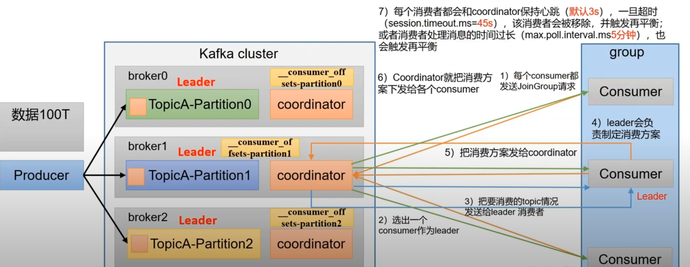

# Kafka Consumer

In order to understand how to read data from Kafka, you first need to understand its consumers and consumer groups. 
In this section, we will learn those concepts.

## Consumers and Consumer Groups

Suppose you have an application that needs to read messages from a Kafka topic, run some validations against them, and 
write the results to another data store. In this case your application will create a consumer object, subscribe to 
the appropriate topic, and start receiving messages, validating them and writing the results. This may work well for 
a while, but what if the rate at which producers write messages to the topic exceeds the rate at which your application 
can validate them? If you are limited to a single consumer reading and processing the data, your application may 
fall farther and farther behind, unable to keep up with the rate of incoming messages. Obviously there is a need to 
scale consumption from topics. Just like multiple producers can write to the same topic, we need to allow multiple 
consumers to read from the same topic, splitting the data between them.

**Kafka consumers are typically part of a consumer group**. When multiple consumers are subscribed to a topic and 
belong to the same consumer group (has same groupId), each consumer in the group will receive messages from a different subset of the 
partitions in the topic.

### Two Mode for sending Message 

There are two modes when we want to get message from server
- pull: the consumer send request to server to transfer data
- push: the server send request to the consumer to transfer data. 

**Kafka uses pull mode**, because push mode requires consumer to have the ability to handle all data send by server. This
is hard to achieve for heterogeneous consumer. The downside of the pull mode is that if the server has zero data to send.
the consumer will still pull and get empty data in response. This will waste cpu and network.

## Consumer group

Consumer group contains one or more consumers. **Inside one consumer group, one consumer can consume data from one or more
topic, but one topic can not be consumed by two consumers**. As a result if you have more consumer than partition number
in a consumer group, some consumer will do nothing.

Below figure shows possible consumer group configuration.

Note, consumers in different consumer groups have no limitation on the same partition of a Topic. You can consider a
consumer group as subscriber independent. 

### Coordinator

As we explained before, one consumer group has many consumers, each consumer only consume data from certain partition.
So we need a **coordinator** to init and distribute partitions to each consumer.

#### Init coordinator
Note each broker provide a **coordinator**, but we only need one **coordinator**. So we need to determine which broker
we will choose. **It dependents on the groupId and the partition number of the __consumer_offsets**:

1. __consumer_offsets_partition_id= groupId%50, (50 is the default partition number of consumer_offsets, can be changed) 
2. broker_id=broker that has the partition of __consumer_offsets_partition_id

For example, if the groupId is 2, then 2 % 50=2, and __consumer_offsets has 3 partition on three broker (broker 1,broker2,broker3)
so broker2 is chosen as the coordinator.

#### Consumer setup

After we selected the coordinator, the coordinator will help the consumer group to set up each consumer:
1. All consumer send JoinGroup request to coordinator
2. Coordinator choose a consumer as **consumer Leader**
3. Coordinator send information of the topic to leader
4. Leader consumer make a consuming strategy
5. Leader send the strategy to coordinator
6. Coordinator send the strategy to all consumers of the group
7. Coordinator keeps the consumer group healthy by eliminating dead consumers. It uses two parameters
   - **session.timeout.ms=45s**: each consumer will send a heartbeat to coordinator (default 3s). If coordinator does not receive a consumer heartbeat for 45s, the consumer is considered dead.
   - **max.poll.interval.ms=300000 (5mins)**: If a consumer pulls data, and process it. If this takes more than 5 mins before it pulls again, the consumer is considered dead.
   - Note after eliminating dead consumer, the coordinator will restart the process from 1 to re-balance the consumer group. 

Below figure shows the complete workflow how a coordinator setup consumers

### Fetch data from broker
After consumer setup in the consumer group, consumers will start to fetch data. Below figure shows the complete workflow
of a consumer:

Each consumer will follow the below workflow:
1. sendFetches: calls ConsumerNetworkClient to run send() method, 
2. The async call (send) has a onSuccess callback, if success, the fetched message will be stored at completedFetches(queue)
3. Consumer will read fetched message inside the queue one by one.
4. each message will go through **parseRecord(deserialization)**, then **Interceptors(custom transformation)**. At last, it applies your consumer logic.

## Application examples