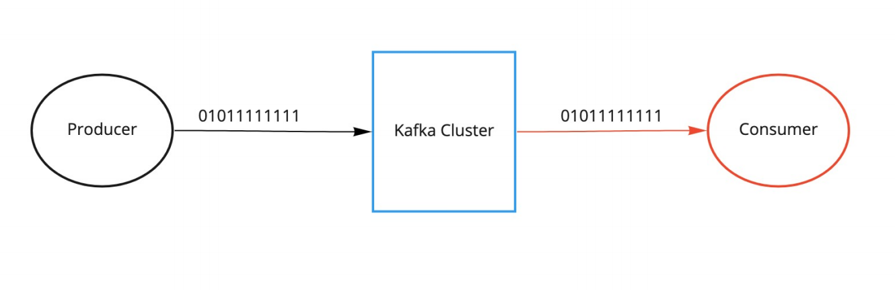
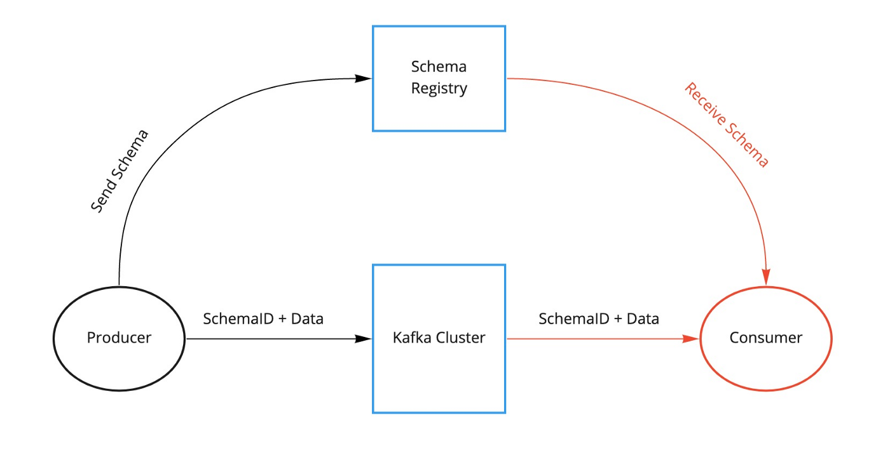
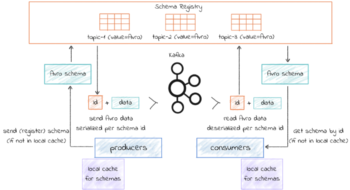
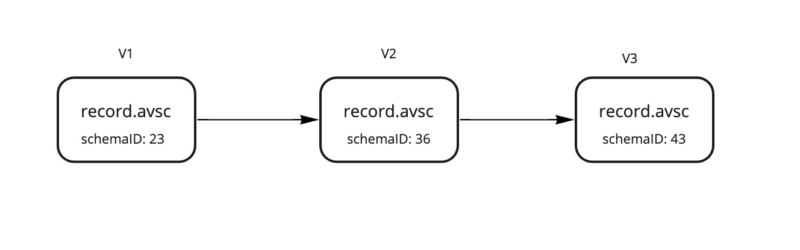
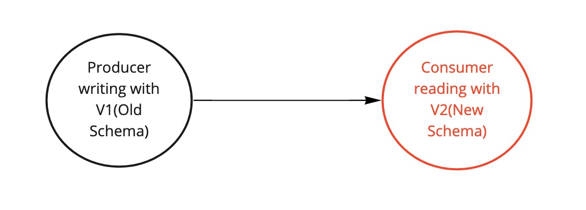
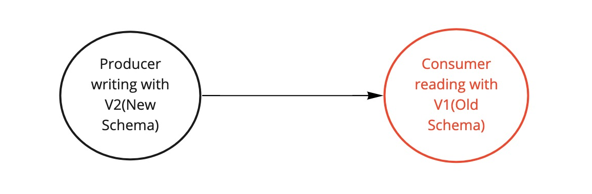

# Why Schema Registry?

Kafka, at its core, only **transfers data in byte format**. There is no data verification at the Kafka cluster level. In fact, Kafka doesn’t 
even know what kind of data it is sending or receiving, or the schema of the data.

Due to the decoupled nature of Kafka, producers and consumers do not communicate with each other directly. At the same time, the consumer still needs to know 
the type of data the producer is sending in order to deserialize it. Imagine if the producer starts sending bad data to Kafka or if the data type of your 
data gets changed. Your downstream consumers will start breaking. We need a way to have a common data type that both producer and consumer must be agreed upon.

Below figure shows kafka workflow without schema registry.



# What is Schema registry?
**Schema Registry** is an application that resides outside of your Kafka cluster and handles the distribution of 
schemas to the producer and consumer by storing a copy of schema in its local cache.
Below figure shows kafka workflow with schema registry.


With the schema registry in place, the producer, before sending the data to Kafka, talks to the schema registry first and checks if the schema is available. 
- If the producer doesn’t find the schema then it registers and caches it in the schema registry.
- If the producer gets the schema, it will serialize the data with the schema and send it to Kafka in binary format prepended with a unique schema ID. 

When the consumer processes this message, it will communicate with the schema registry using the schema ID it got from the producer and deserialize it using the same schema. If there is a schema mismatch, the schema registry will throw an error letting the producer know that it’s breaking the schema agreement.


# Data Serialization Formats
Now that we know how schema registry works, what kind of data serialization format are we using with the schema registry? There are a few important points that we should consider when choosing the right data serialization format:
- If the serialization format is binary.
- If we can use schemas to enforce strict data structures.

Following are some data serialization formats as per the above considerations:
|Name|Binary format| Schema(Interface description language)|
|:---|:----:|:----:|
| Json | No | No |
| XML | No | Yes|
| Yaml | No | No |
| Avro | Yes | Yes|
| Protocol Buff | Yes | Yes|
| thrift | Yes | Yes|


**Apache Avro** has been the default Kafka serialisation mechanism for a long time. Confluent just updated(Dec 2021) their Kafka streaming platform with additional support for serialising data with **Protocol buffers (or protobuf) and JSON Schema serialisation**. For more details about these format, read this [doc](https://simon-aubury.medium.com/kafka-with-avro-vs-kafka-with-protobuf-vs-kafka-with-json-schema-667494cbb2af)

## Apache Avro

**Avro is an open-source binary data serialization format** that comes from the Hadoop world and has many use cases. It offers rich data structures and offers code generation on statically typed programming languages such as C# and Java.

Avro has support for **primitive types**
- int, 
- boolean, 
- string , 
- float 
- etc.

and **complex types**
- enums,
- arrays, 
- maps,
- unions 
- etc.

Avro schemas are defined using JSON. The embedded documentation in Avro can specify what each field/column means. We can have a default value for fields which is very useful when we evolve our schemas.

Let’s look at a sample Avro schema file:

```json
{
  "type" : "record",
  "name" : "User",
  "namespace" : "com.example.models.avro",
  "fields" : [ 
   {"name" : "userID", "type" : "string", "doc" : "User ID of a web app"}, 
   {"name" : "customerName", "type" : "string", "doc" : "Customer Name", "default": "Test User"} 
  ]
}
```

Below figure shows a workflow example of schema registry with avro data serilization


# Schema Evolution

With time, the data schemas will evolve. We may add new fields or update existing fields. With evolving schemas, our downstream consumers should be able to consume messages seamlessly without sending a production alert at 3 AM. Schema Registry is specifically built for data evolution by versioning each schema change.

Below figure shows an example of schema evolution



When a schema is first created, it gets a **unique schema ID and a version number**. If schema changes and the changes are compatible, then we get a **new schema ID and our version number increments**. There are two ways to tell if a schema is compatible: by using a [maven plugin](https://docs.confluent.io/platform/current/schema-registry/develop/maven-plugin.html#schema-registry-test-compatibility) (in Java) or by simply making a REST call. This compatibility check compares schema on the local machine with the schema on the schema registry.

For more details, you can visit the offical [doc](https://docs.confluent.io/platform/current/schema-registry/avro.html)

## Schema evolution pattern
There are various patterns for schema evolution:

### Forward Compatibility: 
For example, if we update producer to V2 version of the schema and gradually update consumers to the V2 version. This is forward compatibility.



### Backward Compatibility: 
If we update all consumers to the V2 version of the schema and then update producer to V2 version. This is backward compatibility




For more details about compatibility patterns, you can visit the offical [doc](https://docs.confluent.io/platform/current/schema-registry/avro.html)

# Install schema registry
The schema registry is developed by confluence with a License (https://github.com/confluentinc/schema-registry/blob/master/LICENSE-ConfluentCommunity). 

The official git [repo](https://github.com/confluentinc/schema-registry)

There is an old doc (https://blog.clairvoyantsoft.com/installing-and-upgrading-the-kafka-schema-registry-2b2944a22244) which can install the schema registry alone

The offical [doc](https://docs.confluent.io/platform/current/installation/installing_cp/overview.html#installation) will install the whole confluence platform with zk, kafka and other staff in it.

To be continued
