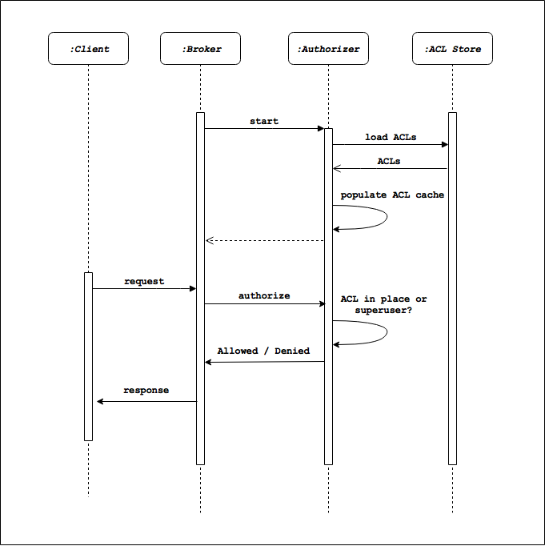

# Kafka authorization
Kafka provides `authentication` and `authorization` using `Kafka Access Control Lists (ACLs)` and through several
interfaces (command line, API, etc.)

Kafka manages and enforces authorization via ACLs through an `authorizer`. An authorizer implements a specific
interface (More [details](https://kafka.apache.org/27/javadoc/org/apache/kafka/server/authorizer/Authorizer.html)), and
is pluggable.

Kafka provides a default authorizer implementation (**AclAuthorize**) that stores ACLs in **ZooKeeper**. The authorizer
class name is provided via the broker configuration authorizer.class.name. If no such configuration exists, then
everyone is authorized to access any resource.

The typical workflow around Kafka authorization is depicted below. At startup the Kafka broker initiates an ACL load.
The populated ACL cache is maintained and used for authorization purposes whenever an API request comes through.




## 1. Terminology for authorization acl

Each Kafka ACL is a statement in this format:

```text
<P> is [Allowed/Denied] <O> From <H> On <R>.
```

- P: (principal) is a kafka user
- O: (Operation) is one element of the list
  [Read, Write, Create, Describe, Alter, Delete, DescribeConfigs, AlterConfigs, ClusterAction, IdempotentWrite, All.]
- H: (Host) is a network address (URL/IP) that allows a kafka client connects to the broker
- R: (Resource) is one of these Kafka resources: [Topic, Group, Cluster, TransactionalId]. These can be matched using
  wildcards

Note not all operations can be applied to every resource. Below is all possible association:

| Resource      | Operations                                                  |
|---------------|-------------------------------------------------------------|
| Topic         | Read, Write, Describe, Delete, DescribeConfigs, AlterConfigs, All |
| Group         | Read, Describe, All                                         |
| Cluster       | Create, ClusterAction, DescribeConfigs, AlterConfigs, IdempotentWrite, Alter, Describe, All  |
| TransactionID | Describe, Write, All|


## 2. Authorization module
In the kafka authentication tutorial, we have added a line in the `server.properties` configuration file

```properties
authorizer.class.name=kafka.security.authorizer.AclAuthorizer
allow.everyone.if.no.acl.found=true
```

This line will enable the kafka default acl authorizer. If you don't want to use the default one, you can implement your own. And the authorizer allows you to manage acl rule. These acl rules control who can do what on your kafka server.


## 3. Managing Acl

This needs you to add an authorizer in the kafka server

First let's see if there are some acl rules or not

```shell
# list existing acl list
./bin/kafka-acls.sh --bootstrap-server localhost:9092 --command-config /home/pliu/git/kafka/projects/Kafka_Server/sasl_kafka_zk/client_config/admin.properties --list
```

## 3.1 Simple example
Add our first acl rule that `allow user bob to read message from topic test-topic`

```shell
$ ./bin/kafka-acls.sh --bootstrap-server localhost:9092 --command-config /home/pliu/git/kafka/projects/Kafka_Server/sasl_kafka_zk/client_config/admin.properties --add --allow-principal User:bob --operation Read --topic test-topic

# You should see below output
Adding ACLs for resource `ResourcePattern(resourceType=TOPIC, name=test-topic, patternType=LITERAL)`: 
 	(principal=User:bob, host=*, operation=READ, permissionType=ALLOW) 

Current ACLs for resource `ResourcePattern(resourceType=TOPIC, name=test-topic, patternType=LITERAL)`: 
 	(principal=User:bob, host=*, operation=READ, permissionType=ALLOW) 

```

## 3.2 More rules

### 3.2.1 Cosuming as a group member

Bob needs a second ACL for committing offsets to group bob-group (using the OffsetCommit API). So we need to add below rules to acl list

```text
Principal bob is Allowed Operation Read From Host * On Group bob-group.
```

```shell
./bin/kafka-acls.sh --bootstrap-server localhost:9092 --command-config /home/pliu/git/kafka/projects/Kafka_Server/sasl_kafka_zk/client_config/admin.properties --add --allow-principal User:bob --operation Read --group bob-group

# You should see below output
Adding ACLs for resource `ResourcePattern(resourceType=GROUP, name=bob-group, patternType=LITERAL)`: 
 	(principal=User:bob, host=*, operation=READ, permissionType=ALLOW) 

Current ACLs for resource `ResourcePattern(resourceType=GROUP, name=bob-group, patternType=LITERAL)`: 
 	(principal=User:bob, host=*, operation=READ, permissionType=ALLOW) 

```

By granting these permissions to bob, **bob can now consume messages from topic test-topic as a member of bob-group.**


### 3.2.2 Describing consumer groups

In the scenario, user pengfei needs permission to retrieve committed offsets from group bob-group (using the OffsetFetch API). For example, he must have the right to run below command
```shell 
bin/kafka-consumer-groups.sh --bootstrap-server localhost:9092 --describe --group bob-group --command-config config/charlie.properties
```


As a result, pengfei needs two ACL rules.
- First ACL rule for fetching offsets from the consumer group bob-group
- Second ACL rule for reading (fetch) offsets of topics test-topic. 

So we should add two rules

```text
# read consumer group
Principal pengfei is Allowed Operation Describe From Host * On Group bob-group.
# read topic
Principal pengfei is Allowed Operation Describe From Host * On Topic test-topic.
```

We can add the two rules by using below command
```shell
bin/kafka-acls.sh --bootstrap-server localhost:9092 --command-config /home/pliu/git/kafka/projects/Kafka_Server/sasl_kafka_zk/client_config/admin.properties --add --allow-principal User:pengfei --operation Read --group bob-group


bin/kafka-acls.sh --bootstrap-server localhost:9092 --command-config /home/pliu/git/kafka/projects/Kafka_Server/sasl_kafka_zk/client_config/admin.properties --add --allow-principal User:pengfei --operation Read --topic test-topic
```

