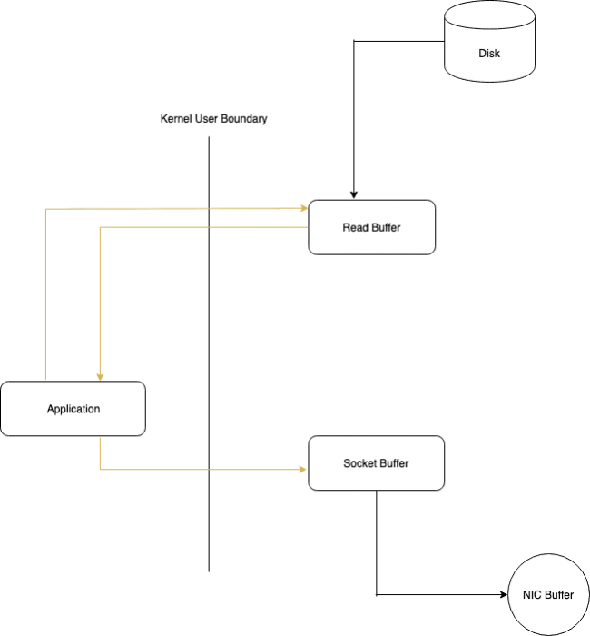
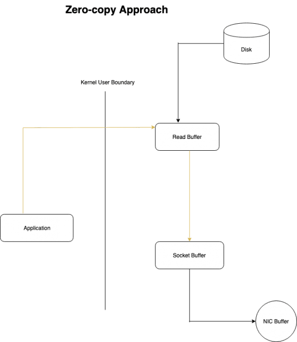

# Zero - Copy Principal

According to wikipedia,

`Zero-copy` describes computer operations in which the CPU does not perform the task of copying data from one memory
area to another. This is frequently used to save CPU cycles and memory bandwidth when transmitting a file over a network.

## Traditional way of the file transfer.
 

Let's consider the traditional way of the file transfer. when a client requests a file from the static website.
Firstly, website static files read from the disk and write the exact same files to the response socket. This is a
very inefficient activity though it appears as the CPU is not performing much activity here.

The kernel reads the data off of disk and pushes it across the kernel-user boundary to the application, and then the
application pushes it back across the kernel-user boundary to be written out to the socket. In effect, the application
serves as an inefficient intermediary that gets the data from the disk file to the socket.

Every time there is a data transfer beyond the kernel user-boundary, there will be consumption of CPU cycles and memory
bandwidth, resulting in a drop in performance especially when the data volumes are huge.

The following figure illustrates a non-zero-copy example.

You can notice the data go through the kernel user boundary and copied by the application, then send back to the socket
which goes through the kernel again.

## Zero copy way of the file transfer

The idea is the application asks the kernel to send data from ReadBuffer to SocketBuffer without going through
the kernel user boundary. As a result, there will be fewer CPU cycles and memory bandwidth.

The following figure illustrates a zero-copy example.

